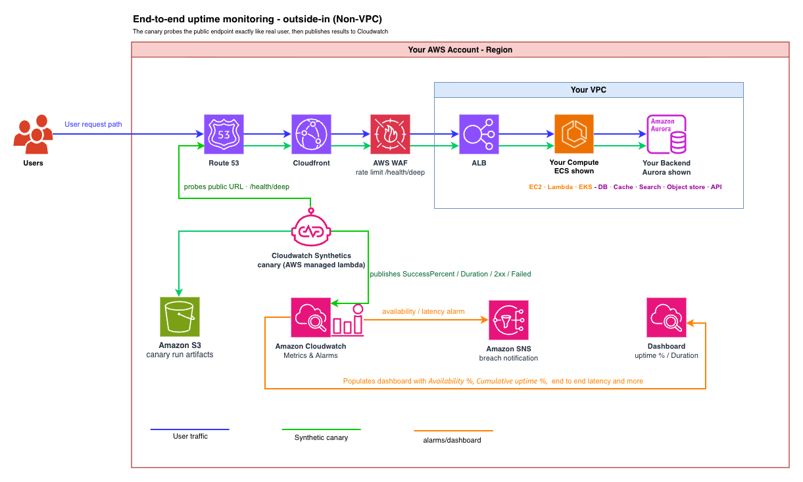
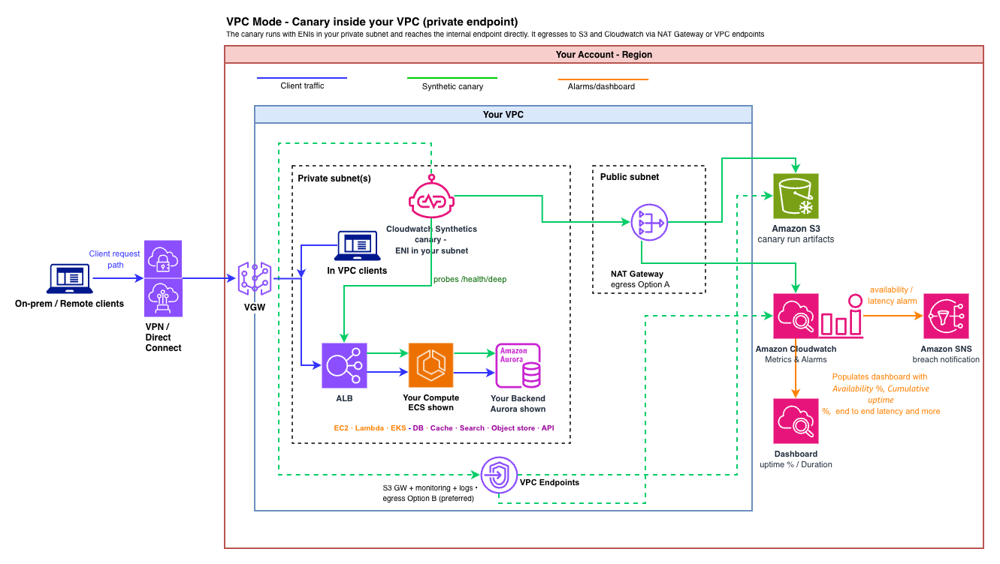

# Deep Health Uptime Canary

**Measure true end-to-end application uptime on AWS** — using Amazon CloudWatch Synthetics canaries pointed at a dedicated deep health endpoint that reaches your backend and back. Compute- and backend-agnostic, deployable in minutes, and extensible to almost any stack.

> "Healthy" isn't the same as "up." A load balancer health check tells you a container is alive; it doesn't tell you a real request can reach your backend and return within a latency budget. This solution measures the real thing — and turns it into an SLA percentage on your dashboard.

## Table of contents

- [Overview](#overview)
- [Prerequisites](#prerequisites)
- [Architecture](#architecture)
- [Quick start](#quick-start)
- [What the solution deploys](#what-the-solution-deploys)
- [The dashboard](#the-dashboard)
- [How uptime is calculated](#how-uptime-is-calculated)
- [What app owners change](#what-app-owners-change)
- [Repository layout](#repository-layout)
- [Documentation](#documentation)
- [Security](#security)
- [License](#license)

## Overview

Most teams monitoring a public application rely on shallow load balancer or container health checks (which by design miss backend and dependency failures), or hand-roll a fragile custom prober (hard to isolate from real traffic). This solution packages the **correct** end-to-end uptime pattern as a reusable asset:

- **Outside-in canary** that probes your endpoint exactly like a real user — through DNS, CDN, TLS, AWS WAF, the load balancer, your application, and its backend dependency.
- **A dedicated deep health endpoint** doing a bounded, read-only dependency check on a replica/reader. The probe deliberately travels the same edge, compute, and backend path as real traffic — that is what makes the measurement honest — but it runs on its own route, with its own bounded client and a trivially cheap read-only query, so it can never starve the resources real requests depend on and never touches user data ([what "isolated" does and doesn't mean](handlers/README.md#what-isolated-does-and-doesnt-mean)).
- **A real SLA %** computed from the run-level `SuccessPercent` metric (its average over any window equals the fraction of runs that passed × 100) on an Amazon CloudWatch dashboard (or Amazon Managed Grafana), with Amazon SNS alerts. It is exact across days and months, and immune to run-cadence changes.

**Why not just use existing health checks?** Load balancer and container health checks are deliberately shallow — they confirm a process is alive and a port is open. You *can* point one at a deep endpoint, but it's an anti-pattern: a failed check makes the balancer deregister the target, so a single slow dependency fails every target at once and turns a degraded backend into a hard outage. They also can't see anything in front of the target — DNS, TLS, AWS WAF, or the load balancer itself. Amazon Route 53 health checks probe from outside but typically hit a shallow endpoint, not a real dependency path. A hand-rolled cron prober means reinventing scheduling, retries, metric publishing, alerting, and traffic isolation. This solution gets the outside-in vantage *and* a genuine end-to-end dependency check, packaged as reusable infrastructure-as-code.

The canary is a managed AWS Lambda function that CloudWatch Synthetics runs **in your own account**. It supports two networking modes with a single parameter: **non-VPC** (public endpoints, the default) and **VPC mode** (private endpoints).

## Prerequisites

- An **AWS account** with permissions for Amazon CloudWatch Synthetics, CloudWatch alarms/dashboards, Amazon SNS, Amazon S3, and AWS IAM.
- The **AWS CLI** installed and configured for your target account and Region. The solution deploys to your configured default Region (from `AWS_REGION`/`AWS_DEFAULT_REGION` or `aws configure`) unless you pass `--region`.
- **Git** and **Bash** (to clone the repo and run `deploy.sh`).
- An application with a **deep-health endpoint** reachable over **HTTPS** (plain `http://` works too, but HTTPS is strongly recommended) — or use the bundled [`sample-app/`](sample-app/). For **VPC mode** only: private subnets with egress to CloudWatch and Amazon S3 (a NAT Gateway, or S3 + `monitoring`/`logs` VPC endpoints).

Full details in [`DEPLOYMENT.md`](DEPLOYMENT.md).

## Architecture

**Non-VPC (default) — for public endpoints:**



**VPC mode — for private endpoints:**



Your workload runs in a VPC in both modes; only the **canary's** placement changes. In non-VPC mode the canary runs outside your VPC (on the AWS-managed Lambda network) and probes your public URL like a real user. In VPC mode it gets ENIs inside your private subnets and probes the internal endpoint directly, egressing to CloudWatch and Amazon S3 via a NAT Gateway or VPC endpoints.

## Quick start

Don't have an app handy? Deploy the optional [`sample-app/`](sample-app/) — a fully serverless, pay-per-request target (Amazon API Gateway → AWS Lambda → Amazon DynamoDB) that costs **≈ $0 idle** — though once a canary is probing it, its two diagnostic EMF metrics run up to **$0.60/month** past your account's 10-metric free tier ([details](sample-app/README.md#cost--safe-to-leave-running)). Otherwise, point the canary at your own endpoint (any path that returns the deep-health contract below — `/health/deep` is just the convention used throughout this repo).

Clone the repo, then run the guided `deploy.sh` — it packages the nested templates to S3 and deploys the stack in one step. Run it with **no flags** and it prompts for stack name, sample-app-or-your-URL, public-or-private, schedule, and alarm email:

```bash
git clone https://github.com/aws-samples/sample-deep-health-uptime-canary.git
cd sample-deep-health-uptime-canary

bash deploy.sh                 # guided (prompts for everything)

# …or fully specified with flags:
bash deploy.sh --sample-app --stack-name deep-health-uptime --schedule "rate(1 minute)" --alarm-email you@example.com
bash deploy.sh --target-url https://your-app/health/deep --stack-name deep-health-uptime --alarm-email you@example.com
```

It prints every stack output when done — including the dashboard name, monitored URL, and SNS topic.

**Verify it works.** Open the CloudWatch dashboard named **`<stack-name>-uptime`** ([shown below](#the-dashboard)). After a few runs, **Availability % (SuccessPercent)** sits at 100% and the **Cumulative uptime %** widget populates. In **CloudWatch → Application Signals → Synthetics Canaries**, open any run to see its step result and the HTTP request report — including the DNS/TCP/TLS/first-byte timing breakdown that tells you *where* a slow response was spent.

**Prove a failure is caught.** With the sample app deployed, induce a real dependency failure and watch the canary flip to failing (and the alarm fire), then recover:

```bash
bash test/break-dependency.sh      # deletes the sample app's health sentinel → 503
bash test/restore-dependency.sh    # re-seeds it → back to healthy
```

Run from a terminal they ask for the region and the DynamoDB table — press Enter at both
prompts to auto-discover the table from the default stack name (`deep-health-uptime`), or
name a different stack. Pass `--table` and `--region` to skip the prompts entirely (e.g.
in CI): `bash test/break-dependency.sh --table deep-health-uptime-health --region us-east-1`.
If you deployed under another stack name, pass `--sample-stack <your-stack-name>`.

> **These two scripts only work against the bundled sample app.** They break and restore
> a DynamoDB sentinel item that is specific to `sample-app/`, so they cannot exercise your
> own application's dependency — and they refuse to run if `--table` points at a table that
> isn't the sample app's. **To prove the alerting path against your own app**, either
> redeploy with a deliberately tight budget (`--slo-ms 1`) so healthy responses breach the
> latency SLO and the alarm fires without touching your backend, or briefly break the
> dependency your health endpoint probes (revoke the reader's permission, point it at an
> unreachable host) and watch the canary report 503.

> **One knob to know:** `SloMs` (default **2000 ms**) is the full response time a user experiences, **including any backend cold start** — cold-start slowness correctly counts against uptime rather than being hidden. A breach is recorded as a **failed run**, not just a latency alarm, so the value has to be honest. The default is sized against the bundled sample app, measured over 4,800+ runs: **p50 ≈ 140 ms, p90 ≈ 175 ms, cold starts ≈ 1.45 s**. **Raise it for a slower backend** — a JVM or .NET target cold-starts past 2 s — and tighten it only once you've confirmed your own p99.

**→ Full deployment guide: [`DEPLOYMENT.md`](DEPLOYMENT.md)** — prerequisites, the deep-health endpoint contract, all deploy methods (guided / one-shot root stack / CloudFormation), the parameters reference, VPC vs non-VPC (with the egress precheck), retargeting, and teardown.

## What the solution deploys

The infrastructure-as-code provisions the **monitoring stack only** — it does not touch your application, compute, or backend:

1. **Amazon CloudWatch Synthetics canary** — runs on a schedule, calls the deep health endpoint, and asserts status + latency.
2. **Canary IAM role** — least-privilege (`cloudwatch:PutMetricData` scoped to the Synthetics namespace, S3 artifact write, and ENI permissions in VPC mode).
3. **Artifact Amazon S3 bucket** — two JSON reports per run (~3.6 KB): `HttpRequestsReport.json` (status, headers, body, and the DNS/TCP/TLS/first-byte timing breakdown) and `SyntheticsReport-PASSED.json` / `-FAILED.json` (step results and, on failure, the stack trace). A 31-day lifecycle rule expires them. There is **no `.har` file and no screenshots** — both come from browser page navigation, and an HTTP step never opens a page; the `httpTimings` breakdown in the request report is the substitute. Canary logs go to CloudWatch Logs, not here.
4. **Availability alarm** — on `SuccessPercent`; fires on the **first** failed run (a failed run is an outage).
5. **Latency alarm** — on the per-step `Duration` vs. the SLO; fires when **2 of the last 3** runs breach it, so one cold start doesn't page you.
6. **Amazon SNS topic** — breach notifications.
7. **Amazon CloudWatch dashboard** (`<stack-name>-uptime`) — four widgets: **Availability % (SuccessPercent)** over time, **End-to-end latency** with the SLO drawn as a threshold line, **Cumulative uptime %** for the selected range, and **Total vs Failed runs**.

**Cost:** roughly **$10.50/month per monitored endpoint** at a 5-minute cadence (about $52.60/month at 1-minute) — almost all of it the canary runs themselves, at $0.0012 each. Alarms and the dashboard are free within the account-wide free tiers ($3.20/month beyond them), and the canary's metrics are included in the run price rather than billed as custom metrics. VPC mode adds a NAT Gateway (~$33/month) unless you use VPC endpoints. See the verified breakdown in [DEPLOYMENT.md → Cost](DEPLOYMENT.md#cost).

## The dashboard


The four widgets above, captured over six hours spanning two real induced outages
(`test/break-dependency.sh`, then `test/restore-dependency.sh`). Each dip is the sample app's
DynamoDB dependency being broken and restored — the canary caught every failed run, and the
availability alarm fired on the first failed run of each dip.

Two things worth reading off this screenshot:

- **The bottom two widgets agree exactly.** 38 of 314 runs failed, and cumulative uptime reads
  **87.9%** — which is `(314 − 38) / 314`. Those are two different statistics on the same metric
  arriving at the same answer, which is the whole basis of the calculation in the next section.
- **The spikes to ~1.2 s are real cold starts**, not monitoring overhead. The latency widget plots
  the **per-step** `Duration`, so it measures the HTTP round trip a user would have waited for —
  canary runtime boot time is excluded.

## How uptime is calculated

Every canary run publishes `SuccessPercent`, `2xx`, `4xx`, `5xx`, `Failed`, and `Duration` to the `CloudWatchSynthetics` namespace. The dashboard computes availability from the **run-level `SuccessPercent`** metric, averaged over whatever time range you're viewing:

```
Uptime % = AVG(SuccessPercent) over the selected range
```

`SuccessPercent` is `100` for a run where every step passed and `0` for a run that failed, so its **average over a window equals the fraction of runs that passed × 100** — exactly the uptime %. Using the run-level metric avoids mixing per-request counts (`2xx`) with per-run counts (`Failed`), which would double-count a run that returns 200 but breaches the latency SLO (that run fails, and "slow is down" — so it must count fully against uptime). The uptime widget uses `setPeriodToTimeRange` so it recomputes for the selected range rather than a fixed period, keeping it **exact across any window** and **immune to run-cadence changes** (1-minute vs. 5-minute probing).

## What app owners change

Exactly one thing in your application: add a `GET` deep-health route — at any path you choose (`/health/deep` is the convention used in this repo) — that does a bounded, read-only dependency probe and returns the standard contract:

```
200 OK   { "status": "ok", "db": "ok", "latencyMs": 12 }   ← up
503      { "status": "degraded", "db": "timeout" }          ← down
```

Copy the reference handler closest to your stack from [`handlers/`](handlers/) and adapt the probe line. Swapping the backend is just swapping the probe (`SELECT 1` on an Aurora reader → DynamoDB `DescribeTable` → Redis `PING`, and so on). Reference handlers ship for **Node.js and Python** across seven backends each (Aurora/RDS, DynamoDB, DocumentDB, ElastiCache, OpenSearch, Amazon S3, and an external API), with dependency isolation baked in.

**One thing to decide while you're in there:** this route is **public and unauthenticated** by design — the canary probes it over HTTPS with no credentials — so keep the response coarse (no stack traces, hostnames, or connection strings) and rate-limit the path. The handler you copy already throttles itself at 60 requests per client IP per minute; an AWS WAF rate-based rule at your edge is the control to add on top, and a shared-secret header is an option if you'd rather not leave it open. All three are covered in [DEPLOYMENT.md → Protecting the health path](DEPLOYMENT.md#protecting-the-health-path-recommended).

## Repository layout

```
sample-deep-health-uptime-canary/
├── README.md              ← you are here
├── DEPLOYMENT.md          ← full deployment & teardown guide
├── LICENSE                ← MIT-0
├── deploy.sh              ← one-step package + deploy (root stack, optional sample app)
├── teardown.sh            ← delete the stack(s) and (optionally) the deploy bucket
├── iac/
│   └── cloudformation/    ← the deployable stack (canary + alarms + dashboard)
├── canary/                ← CloudWatch Synthetics canary script
├── handlers/              ← reference deep-health handlers (Node.js & Python × 7 backends)
├── sample-app/            ← OPTIONAL serverless sample target app (≈ $0 at rest)
├── test/                  ← contract test, failure-demo scripts, repository self-checks
├── images/                ← architecture diagrams and dashboard screenshot
└── .github/workflows/     ← CI: cfn-lint, shellcheck, JS/Python syntax, repo self-checks
```

## Documentation

- **[Deployment and operations guide (`DEPLOYMENT.md`)](DEPLOYMENT.md)** — prerequisites, the endpoint contract, all deploy methods, the [parameters reference](DEPLOYMENT.md#parameters-reference), [protecting the health path](DEPLOYMENT.md#protecting-the-health-path-recommended), [diagnosing high latency](DEPLOYMENT.md#seeing-why-latency-is-high--cold-start-vs-query-time), the [verified cost breakdown](DEPLOYMENT.md#cost), VPC vs non-VPC (egress precheck), retargeting, and teardown.
- **[`handlers/`](handlers/)** — reference deep-health handlers (Node.js and Python) for seven backends each, with dependency isolation baked in.

## Security

See [CONTRIBUTING](CONTRIBUTING.md#security-issue-notifications) for how to report security issues. The canary uses least-privilege IAM and holds no backend credentials — it only makes the HTTP call (the deep-health handler is what reads from a replica/reader with a bounded client and tight timeout). The canary tags its traffic as synthetic (`X-Synthetic: true`) so you can exclude it from real user metrics — it's a label, not an action: your metrics pipeline has to do the filtering. The health path is rate-limited in two layers: every reference handler throttles it in-app (60 requests per client IP per minute by default), and an AWS WAF rate-based rule at your edge (on your ALB / API Gateway / CloudFront) is recommended as the primary control — see [DEPLOYMENT.md](DEPLOYMENT.md#protecting-the-health-path-recommended).

## License

This library is licensed under the MIT-0 License. See the [LICENSE](LICENSE) file.
